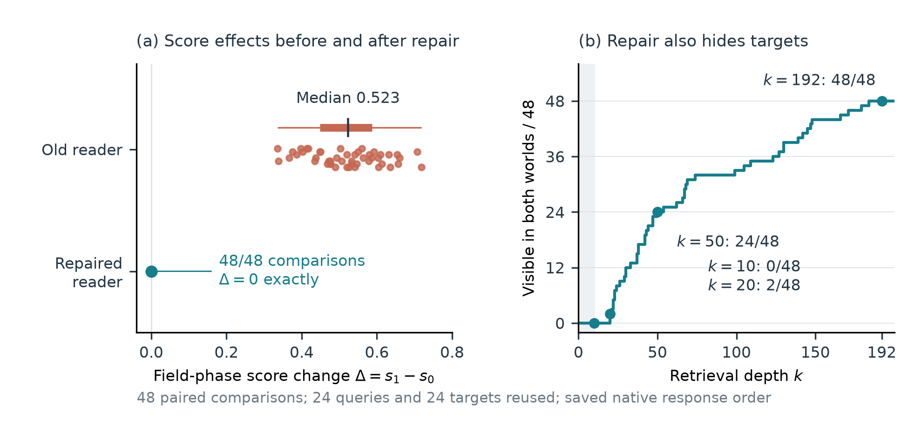
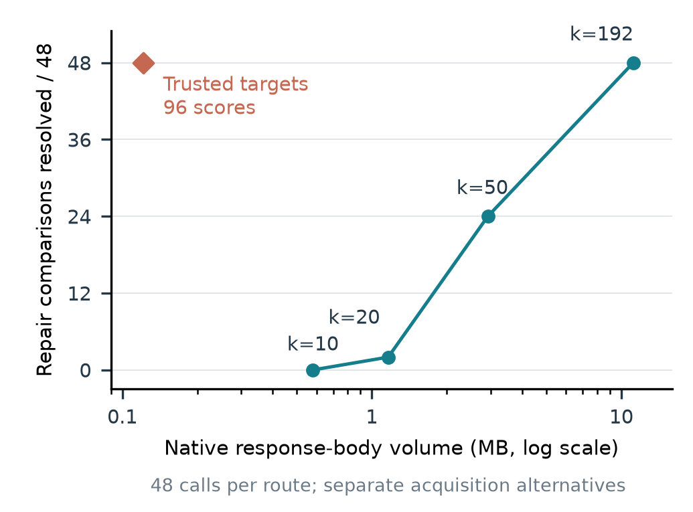
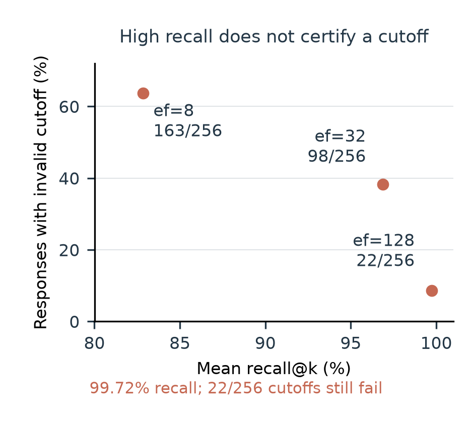

# Results and supporting evidence

The numerical tables below refer to the bundled paper and supplement. Counts are descriptions of fixed workloads with reused queries/states, not estimates of deployment prevalence. T/N/I denote supported effect, no detectable effect and insufficient evidence.

| Paper claim / location | Supporting result | Evidence and computation |
|---|---|---|
| Native update detection can preserve excluded metadata influence (§V-A) | The affected release processes no update; target score remains 0.910012 instead of the clean-rebuild 0.112141. The fixed version processes the edit and matches rebuilding. | [Native stores and fixture](data/upstream_update/); [16-score reconstruction](scripts/upstream_update.py) |
| Input exclusion alone does not replace stored vectors (§V-A) | SKIP leaves 48 target effects; replacing all 384 vectors removes complete-score effects. | [Migration observations](data/migration/); [calculation](scripts/migration.py) |
| Successful writes do not identify the serving reader (§V-A; Fig. 2) | The stale reader retains 48 effects; correcting the reader yields 48 exact-zero paired differences. | [Snapshots and raw responses](data/reader_repair/); [recomputation](scripts/reader_repair.py); [paired scores/ranks](results/repair_pairs.csv) |
| Repair can make sufficient evidence disappear (§V-B; Fig. 2) | Corrected target positions range from 20 to 184, median 52. Tested depths 10/20/50/192 resolve 0/2/24/48 of the same 48 comparisons. | [48 comparison values](results/repair_pairs.csv); [response checks](scripts/reader_repair.py) |
| Target scoring reduces acquisition volume (§V-C; Fig. 3) | At 48 calls, full depth returns 9,216 scores/11,171,866 bytes; target scoring returns 96/121,694, a 98.91% reduction. | [Channel CSV](results/repair_acquisition.csv); [native-body byte accounting](scripts/reader_repair.py) |
| Equal access removes a decision-rule advantage (§V-C; Table II) | Direct rescoring and singleton intervals give identical verdicts and volumes. Median times are 5.469/5.471 s (old) and 5.365/5.378 s (corrected), with overlapping ranges. | [Raw baseline batches and binding evidence](data/equal_access/); [baseline check](scripts/equal_access.py) |
| High recall does not certify omitted scores (§V-D; Fig. 4) | At efSearch 8/32/128, invalid cutoffs are 163/98/22 of 256 responses; mean recall is 82.83%/96.87%/99.72%. No incorrect decisive labels were observed. | [Saved responses and full scores](data/ann/); [ANN recomputation](scripts/ann.py); [figure data](results/ann_cutoffs.csv) |
| Rank and pair-gap proxies can misattribute effects (Supplement B; Table IV) | Top-ten rank/gap proxies have 107/25 false supports. Guarded visible target scores detect 45 effects; valid target intervals detect all 72, with zero false supports. | [All 1,152 comparison records](data/attribution/episodes.jsonl); [rule reconstruction](scripts/attribution.py) |
| Depth and numerical precision affect evidence sufficiency (Supplement C; Tables V–VII) | Across 1,728 episodes, full precision gives 531/999/198 T/N/I. Four decimals give 501/0/1,227; rounded point treatment creates 18 false no-effect labels. | [Natural and engineered intervals](data/precision/); [precision/tolerance recomputation](scripts/precision.py) |
| Exact top-k bounds add limited coverage on public text (Supplement D; Table VIII) | Both native scorers improve from 385/432 to 389/432 determinate cells; nine of twelve corpus/depth conditions show zero gain. | [SciFact inputs, vectors and responses](data/scifact/); [independent score reconstruction](scripts/scifact.py) |
| Tighter geometric bounds need not add decisions (§V-D; Supplement F; Table IX) | A/B/P/C all give 1,957/1,943/980 T/N/I. 998 missing-score intervals narrow; zero decisions change. | [Public packet, certificates and separate oracle](data/geometry/); [exact-arithmetic certificate check](scripts/geometry.py) |

[paper_tables.json](results/paper_tables.json) contains the seven numerical tables in the current paper/supplement. Tables I and III describe applicability and participant roles; their substance is covered by the experimental procedure. The figure CSVs preserve native ordering and full numerical values.

## Interpretation of the main figures

Each score difference is world 1 minus world 0 within the indicated reader state. The corrected differences are all exactly zero. Ranks retain the native tie ordering; no confidence interval is inferred from these reused comparisons.

The five channels use separate 48-call budgets. Body bytes exclude headers, setup and human effort. The 10,684-byte score-only projection in the CSV is produced after acquisition; it is not the 121,694-byte acquired volume.

A cutoff is invalid when an omitted native score exceeds it by more than epsilon. A bound failure is distinct from an incorrect final label: the fixed workload has twelve naive target-interval containment failures and zero incorrect decisive labels.

## Evidence scope

Serving checks reconstruct scores from saved native vectors and validate retained response bytes; baseline checks reconstruct the matched comparison. The attribution and precision checks start from saved per-comparison values and intervals. SciFact recomputes scores from captured vectors; ANN reanalyzes stored responses/full-score arrays. Geometry verifies recorded public certificates before comparing against the separate target oracle. Model inference and original service collection are not repeated by these checks.

The negative findings and insufficient cases are included. The conclusions depend on controlled field histories, comparable native scores, valid numerical bounds and trusted acquisition/state binding; they do not authenticate an adversarial host or establish deletion or answer privacy.
